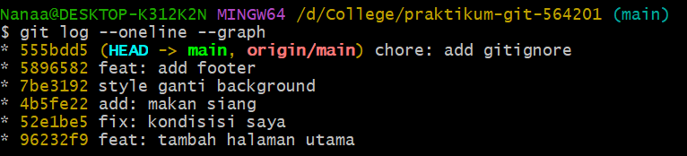
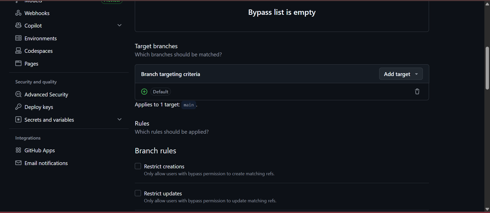
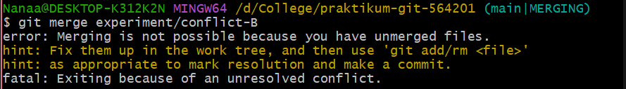
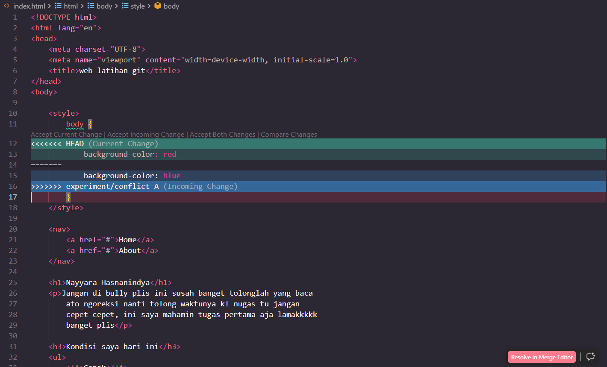
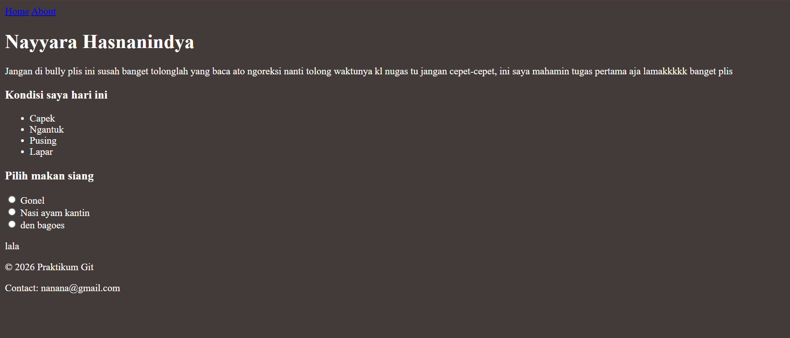

# Praktikum Git

Repository praktikum Git dengan 5 commit menggunakan Conventional Commits.

## Git Log (Latihan 1)

## Branch Protection Rule (Latihan 2)

## Conflic and Conflict HTML (Latihan 3)

## Latihan 5
## Deskripsi
Praktikum ini merupakan latihan dalam penggunaan GitHub terutama dalam baranching, merging, conflict resolutioh, dan interatictive rebase.

## Cara menjalankan 
1. Clone repository: git clone https://github.com/nanahsnndy/praktikum-git-564201.git
2. Masuk folder: cd praktikum-git-564201
3. Buka file: index.html di browser

## Website

## Perintah Git yang digunkan
- git init = inisialisasi repository
- git add = menambah file ke staging
- git commit = menyimpan perubahan
- git push = upload ke GitHub
- git branch = melihat/membuat branch
- git checkout = pindah branch
- git merge = menggabungkan branch
- git rebase -i = squash commit
- git log --oneline --grpah = melihat riwayat commit